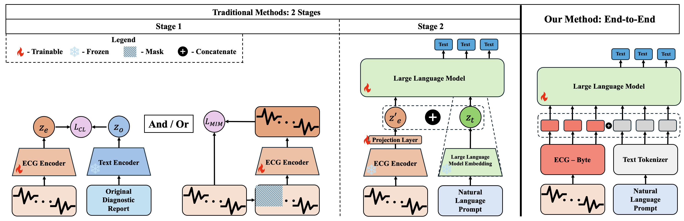
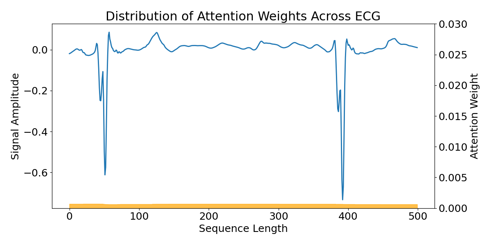
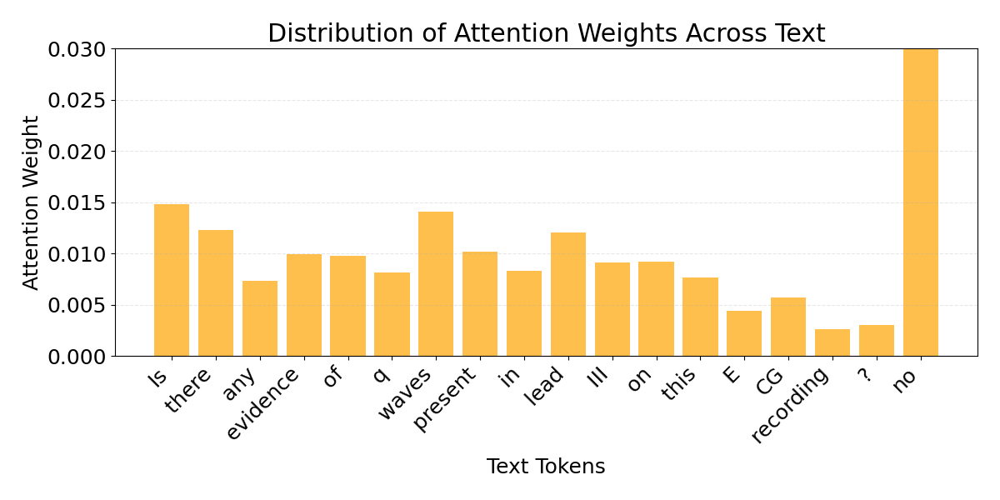
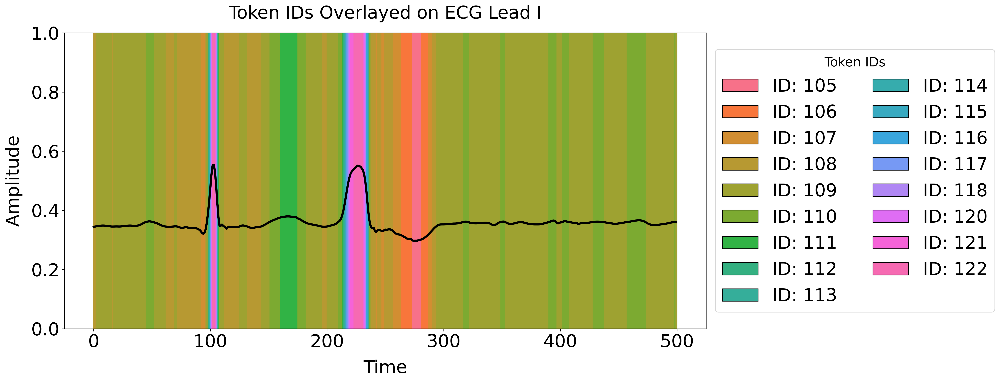
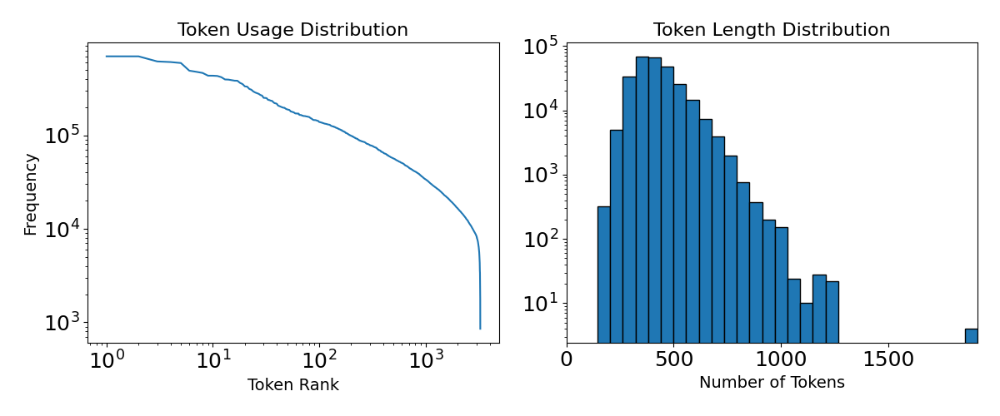

<h2 align="center">
  ECG-Byte: A Tokenizer for End-to-End Generative <br/>Electrocardiogram Language Modeling
</h2>

<div align="center">
  
</div>


## Table of Contents
1. [Overview](#overview)
2. [Installation](#installation)
3. [Data](#data)
4. [Main Methods](#methods)
  - [Training ECG-Byte](#ecg-byte)
  - [Training LLM](#endtoend-train)
  - [Inference LLM](#endtoend-inference)
  - [Analysis of methods](#endtoend-analysis)
  - [Training 1st Stage](#twostage-train1)
  - [Training 2nd Stage](#twostage-train2)
  - [Inferencing 2 Stage](#twostage-inference)
5. [Known Issues + Tips](#issues)
6. [Acknowledgements](#ack)

## Overview <a name="overview"></a>
This repository is the official implementation of [ECG-Byte: A Tokenizer for End-to-End Generative Electrocardiogram Language Modeling](https://arxiv.org/abs/2412.14373)
by [William Jongwon Han](https://willxxy.github.io/), [Choajing Duan](https://www.linkedin.com/in/chaojing-duan-0b3266127), [Michael A. Rosenberg](https://scholar.google.com/citations?user=o0Y0GLcAAAAJ&hl=en), [Emerson Liu](https://www.linkedin.com/in/emerson-liu-950479/), and [Ding Zhao](https://www.meche.engineering.cmu.edu/directory/bios/zhao-ding.html).

Please carefully read the below documentations to run the pipeline. If there are any questions or bugs, please do not hesitate to reach out to wjhan{@}andrew{dot}cmu{edu} or submit an issue with corresponding details.

All installations and experiments were completed on Ubuntu 20.04.5 LTS with NVIDIA A6000 GPUs.

We want to note that the codebase is quite messy and we plan on cleaning it up and adding more modularity for better readability, structure, and modifiability.
For now, please read the following description of the main files and folders to consider in the codebase.

1. `data_loader.py` - Dataloader classes for training end to end LLM and 2 stage training.

2. `main.py` - Main end to end training pipeline.

3. `train_tokenizer.py` - File for training ECG-Byte.

4. `pretrain.py` - Pretraining pipeline for 1st stage training

5. `finetune.py` - Finetuning pipeline for 2nd stage training.

6. `interp_analysis.py` - After training the end to end pipeline, this code is for running the pipeline for attention visualizations.

7. `scheduler.py` - Our custom scheduler for training our end to end method and 2 stage training method.

We provide the functions that are utilzed throughout the codebase in the following individual folders.

1. `analysis` - Folder containing the mapping between ECG and tokens and plotting token distributions/usage.

2. `models` - Folder containing all implemented models in the study.

3. `preprocess` - Folder containing the main preprocessing pipeline.

4. `runners` - Folder containing our training, inferencing, and interpretability runners.

5. `rust_bpe` - Folder containing the main ECG-Byte code.

6. `scripts` - Folder containing bash scripts to execute all preprocessing and main experiments.

7. `utils` - Folder containing all of the helper functions used throughout the codebase.

## Installation <a name="installation"></a>

1. To install Rust: `curl --proto '=https' --tlsv1.2 -sSf https://sh.rustup.rs | sh -s -- --default-toolchain=1.79.0 -y`

2. Open a new terminal to set PATH for Rust installation.

3. After opening a new terminal, check the installation by running `rustc --version`.

4. Create the conda virtual environment via `conda create -n ecg-byte python=3.10.15`.

5. Activate the environment `conda activate ecg-byte`

6. `pip install torch==2.3.1 torchvision==0.18.1 torchaudio==2.3.1 --index-url https://download.pytorch.org/whl/cu118`

7. `git clone https://github.com/willxxy/ECG-Byte.git`

8. Please `cd` into the `ECG-Byte/transformers` directory and `pip install -e .`.

9. Now `cd ../` and `pip install -e .`

10. Run the `ECG-Byte/test/test_gpu.py` to ensure you are able to use your GPU.

11. Run the `ECG-Byte/test/test_transformers.py` to ensure you properly installed the `transformers` package.

12. `cd` into `ECG-Byte/ecg_byte/rust_bpe` and execute `maturin develop --release` to compile the tokenizer.

13. Another consideration is that we use ***gated*** models (e.g., Llama 3.2, Gemma) from HuggingFace, therefore you will need to get an api key and log into it via `huggingface-cli login` in the terminal. We also require you to log in inside the main training *.py file via the login function `from huggingface_hub import login`.

NOTE: From now, all instructions will assume you are working from the `ECG-Byte/ecg_byte` directory.

## Data <a name="data"></a>

As described in the paper, we have only experiments with training on **25%** of each respective dataset.
However, if you have enough compute, feel free to modify to run the pipeline with the full data!

### PTB-XL

1. Please download the PTB-XL dataset through this [link](https://physionet.org/static/published-projects/ptb-xl/ptb-xl-a-large-publicly-available-electrocardiography-dataset-1.0.3.zip).

2. Please create a `data` folder, unzip the zip file inside the `data` folder and rename the folder as `ptb`.

### MIMIC

1. Please download the Mimic IV ECG dataset through this [link](https://physionet.org/static/published-projects/mimic-iv-ecg/mimic-iv-ecg-diagnostic-electrocardiogram-matched-subset-1.0.zip).

2. Unzip the zip file inside the `data` directory and rename the unzipped directory as `mimic`.

### [ECG-QA](https://github.com/Jwoo5/ecg-qa)

1. To download the ECG-QA dataset, please execute the following command in the `data` folder:

`git clone https://github.com/Jwoo5/ecg-qa.git`

2. We exactly follow the instructions in [this section of the repository](https://github.com/Jwoo5/ecg-qa?tab=readme-ov-file#usage-notes) for mapping the PTB-XL and MIMIC IV ECG dataset to the question and answers. `cd` into ecg-qa and execute the following commands in the terminal to prepare the ECG-QA dataset.

```
python mapping_ptbxl_samples.py ecgqa/ptbxl \
--ptbxl-data-dir ../ptb
```

```
python mapping_mimic_iv_ecg_samples.py ecgqa/mimic-iv-ecg \
--mimic-iv-ecg-data-dir ../mimic
```

3. After mapping the datasets, you should have an output folder in the `data/ecg-qa` folder with the mapped `paraphrased` and `template` question and answers.

### Pretrain MIMIC dataset curated by [ECG-Chat Zhao et al.](https://github.com/YubaoZhao/ECG-Chat)

3. Next create a `data/ecg_chat_data` directory and download the `pretrain_mimic.json` file from this [dropbox link](https://www.dropbox.com/scl/fo/ccq5dxmdgg4shf02yjn8c/ANOQ1Hzj4KwHqa1b9r80uzc?rlkey=teysp3v6hg6o9uko2i4zbbjpn&e=1&st=exu3i9oo&dl=0).

Once you are finished with these steps, it's time to preprocess the data!

### Preprocessing

1. Execute the preprocessing script by `bash scripts/preprocess.sh`. We have provided default configurations for all the datasets used in our study but feel free to experiment with others!

2. After preprocessing, you will see files with this structure: `data/{data_name}_{seg_len}`, where data_name is the dataset name, and seg_len is the segment length of each ECG (e.g., 500, 1250, 2500). For sampling and training the tokenizer, we utilize data from mimic with seg_len = 2500 for the full 10 seconds

3. Due to the enormity of the data, in our paper, we sample a subset of the 2500 seg_len ECGs to train the tokenizer. In order to do this, please execute `bash scripts/sample_ecg.sh`.

After sampling, you should see a `.txt` file appear in the `data` which represents the sampled ECGs.

## Main Methods <a name="methods"></a>

### Training ECG-Byte <a name="ecg-byte"></a>

1. Once you sampled the ECGs, you can simply run `bash scripts/train_tok.sh` to train the tokenizer. We also provide a script to load in your trained tokenizer and see the encoding compression rate and original vs. decoded signal. Lastly, we provide basic configurations, however, please feel free to modify these.

NOTE: We also provide a trained tokenizer at this [link](https://drive.google.com/drive/folders/1IFrg-XRRDhJ_xIUSxjcXwxvyPLdsbMR0?usp=sharing). Please feel free to use this or train your own!

### Training LLM <a name="endtoend-train"></a>

1. We provide training scripts in `scripts/train_model.sh` for both distributed and single GPU setting. Please utilize whichever script for your own setting. To train the model just simply run `bash scripts/train_model.sh` after defining the correct paths. We provide an example of how it should look like below and in the `.sh` file.

```
python main.py \
--model=meta-llama/Llama-3.2-1B \
--tokenizer_check=$TOKENIZER_NAME \
--device=cuda:0 \
--batch_size=2 \
--pad_to_max=1020 \
--peft \
--num_merges=3500 \
--epochs=1 \
--percentiles=$PATH_TO_PERCENTILES_FROM_PREPROCESSING \
--dataset=$DATASET_FOLDER_NAME \
--gpus=0,1,2,3 \
--dis \
--ports=12359
```

If you do not have multiple GPUs, simply modify the script like so:

```
python main.py \
--model=meta-llama/Llama-3.2-1B \
--tokenizer_check=$TOKENIZER_NAME \
--device=cuda:0 \
--batch_size=2 \
--pad_to_max=1020 \
--peft \
--num_merges=3500 \
--epochs=1 \
--percentiles=$PATH_TO_PERCENTILES_FROM_PREPROCESSING \
--dataset=$DATASET_FOLDER_NAME \
--device=cuda:0
```

NOTE: With our LoRA configurations, sequence length of 1024, and a batch size of 2, this sums up to ~14 GB of GPU memory. We also provide finetuned checkpoints of the main models (Llama 3.2 1B) for ECG-QA PTB-XL, ECG-QA MIMIC-IV, and Pretrain MIMIC at this [link](https://drive.google.com/drive/folders/1IFrg-XRRDhJ_xIUSxjcXwxvyPLdsbMR0?usp=sharing).

### Inference LLM <a name="endtoend-inference"></a>

1. We provide inference scripts in `scripts/inference.sh` for generating answers. We have set the initial configurations but feel free to modify them. To inference the model simply run `bash scripts/inference.sh`. We provide an example of how the script should look like below and in the `.sh` file.

```
python main.py \
--model=meta-llama/Llama-3.2-1B \
--tokenizer_check=$TOKENIZER_NAME \
--batch_size=1 \
--pad_to_max=1020 \
--device=cuda:4 \
--peft \
--num_merges=3500 \
--percentiles=$PATH_TO_PERCENTILES_FROM_PREPROCESSING \
--checkpoint=$PATH_TO_CHECKPOINT_FOLDER \
--inference \
--dataset=$DATASET_FOLDER_NAME
```

NOTE: With our LoRA configurations and a batch size of 1, inference sums up to ~5 GB of GPU memory.

### Analysis of Results <a name="endtoend-analysis"></a>

1. We provide a number of anlaysis scripts seen in our paper, namely the attention visualizations in subsection 5.5 and the ECG-Byte analysis in subsection 5.4.

2. To visualize the attentions and get the overlayed attention images, utilize the script `scripts/interpret.sh`. Below is an example of the outputted visualization:

<div align="center">
  <table>
    <tr>
      <td></td>
      <td></td>
    </tr>
  </table>
</div>

3. To visualize how ECG-Byte is merging the signal, please use the script `scripts/track_encoding.sh`. Below is an example of the outputted visualization:

<div align="center">
  
</div>

4. To visualize the token usage and distribution of ECG-Byte, please use the script `scripts/token_dist.sh`. Below is an example of the outputted visualization:

<div align="center">
  
</div>

### Training the 1st Stage for 2 Stage Training Methods <a name="twostage-train1"></a>

1. The 1st stage training script is provided in `scripts/pretrain.sh`, where we provide the default configurations to set for training all of the implementations. Please feel free to follow the paper's configurations or utilize your own! Below is an example of how the script should look like.

```
python pretrain.py \
--model=resnet \
--batch_size=64 \
--device=cuda:2 \
--peft \
--epochs=20 \
--seg \
--dataset=$DATASET_FOLDER_NAME \
--gpus=0,1,2,3 \
--dis \
--log
```

NOTE: We also provide pretrained checkpoints of all 2 stage methods we implemented at this [link](https://drive.google.com/drive/folders/1IFrg-XRRDhJ_xIUSxjcXwxvyPLdsbMR0?usp=sharing).

### Training the 2nd Stage for 2 Stage Training Methods <a name="twostage-train2"></a>

1. We also provide the scripts to train the 2nd stage in `scripts/finetune.sh`, where we provide the default configurations to set for training all of the said implementations. Again, please feel free to follow the paper's configurations or utilize your own! Below is an example of how the script should look like

```
python finetune.py \
--model=resnet_model \
--batch_size=2 \
--pad_to_max=1022 \
--peft \
--epochs=1 \
--seg \
--dataset=ptb_qa \
--first_check=$PATH_TO_1st_STAGE_CHECKPOINT_FOLDER \
--gpus=0,1,2,3 \
--dis \
--ports=12359
```

### Inferencing 2 Stage Trained Methods <a name="twostage-inference"></a>

1. We provide the scripts to inference the 2 stage training methods after completing the 1st and 2nd stage. Please utilize the `scripts/inference.sh` script for inference.

```
python finetune.py \
--model=resnet_model \
--batch_size=1 \
--pad_to_max=1022 \
--device=cuda:4 \
--peft \
--num_merges=3500 \
--dataset=ptb_qa \
--inference \
--first_check=$PATH_TO_1st_STAGE_CHECKPOINT_FOLDER \
--checkpoint=$PATH_TO_CHECKPOINT_FOLDER
```

## Known Issues + Tips <a name="issues"></a>

We encountered some issues during development of ECG-Byte and hope to contribute to the open source community by reporting them here and adding any tips if possible. If you happen to know a good solution to any of them, please do not hesitate to open an issue or pull request!

1. `tqdm` bar freezing script with multiprocessing - We noticed that the tqdm bar freezes sometimes when we put it inside a multiprocessing job (especially during preprocessing). We recommend adding print statements before and after the main operations inside the tqdm loop to ensure the operations are being executed. This is a [thread of the issue](https://github.com/tqdm/tqdm/issues/1160) from the tqdm repository. Please feel free to look at it!

2. Utilizing inputs_embeds for generation - We noticed that utilizing inputs_embeds as the primary input to the model for generation is quite instable (e.g., [example1 from HF](https://github.com/huggingface/transformers/issues/23042), [example2 from stackoverflow](https://stackoverflow.com/questions/78857426/error-when-using-inputs-embeds-with-generate-method), [example3 from vllm but related](https://github.com/vllm-project/vllm/issues/416), [example4 from HF](https://github.com/huggingface/transformers/pull/32493)). When we tried generating via only `inputs_embeds` the model failed to generate anything coherent (i.e., mostly empty strings). Our current workaround is passing in both `input_ids` and `inputs_embeds` as inputs for generation. The reasoning behind this is from the [GenerationMixin code](https://github.com/huggingface/transformers/blob/main/src/transformers/generation/utils.py#L332C1-L332C2) and this [thread](https://github.com/huggingface/transformers/issues/23042). From the code, it seems like the model creates an empty input_ids tensor of shape (batch_size, 0) and uses the embeddings only for the first forward pass. However, this can be unstable because there's no explicit token mapping for the embeddings, making it harder for the model to maintain coherence between the embedded representation and subsequent token generation. The solution for this would be to create better `inputs_embeds` from the getgo. However, we wanted to add some guidance to the generation therefore we provided embeddings for the initial forward pass while having input_ids that explicitly map to those embeddings, providing a more stable foundation for generation. This is not "true" generation only using `inputs_embeds`, therefore we believe that this reinforces our method of representing ECGs even more.

3. HuggingFace api key not being recognized - We also noticed that the main training script sometimes crashes due to the huggingface api key not being recognized. The current workaround is just to relogin utilizing your own personal api key. 

4. Nan values during preprocessing - We noticed that the MIMIC-IV ECG dataset has many nan values during preprocessing so we workaround this by skipping them.

5. When sampling ECGs (`ecg_byte/preprocess/sample_ecg.py`, we currently have the following configurations for the number of threads:

```
os.environ['OPENBLAS_NUM_THREADS'] = '4'
os.environ['MKL_NUM_THREADS'] = '4'
os.environ['VECLIB_MAXIMUM_THREADS'] = '4'
os.environ['NUMEXPR_NUM_THREADS'] = '4'
```

We noticed that on some machines under computational constraints this number is too high when largely launching the PCA analysis, thus resulting in a crash. 
In this case, simply reduce the maximum number of threads for each os.environ to either 1 or 2.
Reducing this number should solve the problem, however, if you continue to run into crashes please feel free to report an issue!

## Acknowledgements <a name="ack"></a>
This work is done in collaboration with the Mario Lemieux Center for Heart Rhythm Care at Allegheny General Hospital. 
We thank Wenhao Ding, Haohong Lin, Shiqi Liu, and Hyoeun Kang for the valuable discussions.

We thank the authors of [MERL](https://github.com/cheliu-computation/MERL-ICML2024) for their ResNet code and the authors of [ECG-QA](https://github.com/Jwoo5/ecg-qa), and [ECG-Chat](https://github.com/YubaoZhao/ECG-Chat) for their publicly released datasets.

Lastly, we thank [HuggingFace](https://huggingface.co/) for providing the APIs for the models.

## Citations
If this work has helped you please cite the following:

```
@misc{han2024ecgbytetokenizerendtoendgenerative,
      title={ECG-Byte: A Tokenizer for End-to-End Generative Electrocardiogram Language Modeling}, 
      author={William Han and Chaojing Duan and Michael A. Rosenberg and Emerson Liu and Ding Zhao},
      year={2024},
      eprint={2412.14373},
      archivePrefix={arXiv},
      primaryClass={cs.CL},
      url={https://arxiv.org/abs/2412.14373}, 
}
```
